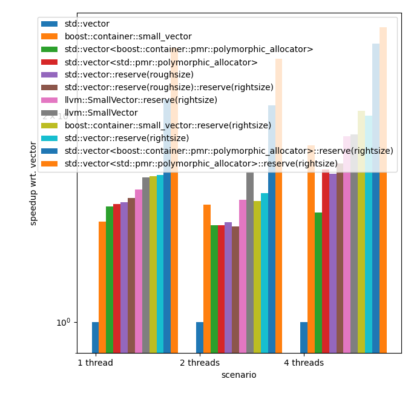

speedups (higher is better) wrt `std::vector`.

## when the vector will be filled with exactly the number of (compile time) expected elements

## when the vector will be filled with less than the number of (compile time) expected elements

## when the vector will be filled with more than the number of (compile time) expected elements

In this case, the `boost::container::static_vector` cannot be used.

